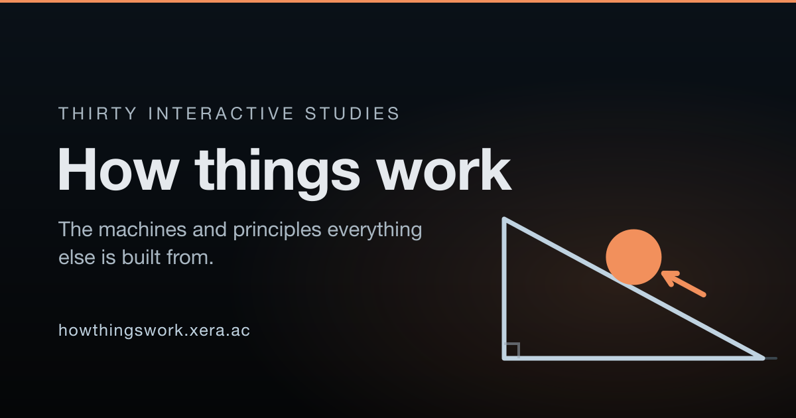

# How Things Work

Explore everyday machines through an illustrated neighborhood and interactive 3D lessons. Follow a mechanism, inspect its parts, change its controls, and see the result.

[Explore the website](https://howthingswork.xera.ac/) · [Watch the tour](https://howthingswork.xera.ac/tour.mp4)

[](https://howthingswork.xera.ac/)

## Explore

- Enter places and rooms, or search **All machines & ideas**.
- Use **How it works**, **Meet the parts**, **Controls**, and **Try it yourself** to explore each lesson.
- Hover over or click a part to see its name. Click elsewhere to clear selection.
- Drag the object to move it; drag outside it to rotate. Scroll or pinch outward to separate related parts into groups. The **+** and **−** buttons change camera zoom.
- Use the back button to leave a machine. From a room or place, zoom outward or use the back button to return.

The public catalog contains individually reviewed lessons. Complete smaller mechanisms appear beneath their parent machine. Work in progress stays outside the public catalog. Each lesson states its modeling assumptions and limits; these are teaching models, not engineering specifications.

The silent tour lasts about 3 minutes 45 seconds and has no subtitles. It covers neighborhood navigation, a sewing-machine cycle, part inspection and separation, a refrigerator compressor, mirrors, lenses, and a 3D printer completing a layer.

## Run locally

Use Node.js 22.18 or newer. Node.js 24 LTS is a suitable choice.

```sh
npm ci
npm run dev
```

Open the local URL printed by Vite. To build and serve the production site:

```sh
npm run build
npm run preview
```

Serve the contents of `dist/` from the root of a static web host. Navigation uses URL fragments; no application server or database is required.

## Verify changes

```sh
npm test
npm run build
node src/site/check-house.mjs
node src/site/check-lessons.mjs
```

Focused model and browser checks live beside their lessons in `src/site/`. Browser checks require Playwright and its Chromium browser (`npx playwright install chromium`); some detailed visual checks use installed Google Chrome. `npm run test:browser` runs checks sequentially and reports any failed attempt as a failure. Use `SITE_URL` to check an existing server. The deployment smoke checker also accepts `PLAYWRIGHT_MODULE` for an external Playwright installation. Checks that load source fixtures require the Vite development server.

```sh
SITE_URL=http://127.0.0.1:4173/ npm run check:publication
npm run test:deployment -- https://howthingswork.xera.ac/
```

Passing a check establishes the behavior it tests. It does not establish complete coverage of every mechanism or scientific assumption.

## Record the tour

`scripts/record-tour.mjs` records real browser interactions and encodes a silent MP4. It requires installed Google Chrome, FFmpeg, and Playwright. Output goes to the local `documentation/` directory. Move an existing tour aside before recording; the encoder refuses to overwrite it.

```sh
npm install --no-save --package-lock=false playwright
node scripts/record-tour.mjs
```

Review the recording before copying it to `public/tour.mp4` for publication.

## Source layout

- `src/site/`: neighborhood navigation, catalog, 3D mechanisms, lessons, and their checks.
- `src/scene/`: earlier principle-study modules and checks.
- `public/`: static images, icons, sitemap, and published tour.
- `scripts/`: build helpers, browser checks, and tour recording.

`src/site/published-catalog.js` controls public lesson admission. Development-only previews can be enabled with `VITE_PREVIEW_UNPUBLISHED=1`; production builds retain the public admission list. A preview route is not a completed lesson.

Reference documents, review evidence, local drafts outside the source tree, and private deployment settings are excluded from Git. Optional analytics uses `VITE_GOOGLE_ANALYTICS_ID` in an untracked `.env.local`. Client build settings are visible to visitors and must never contain secrets.

## License

[MIT](LICENSE).
